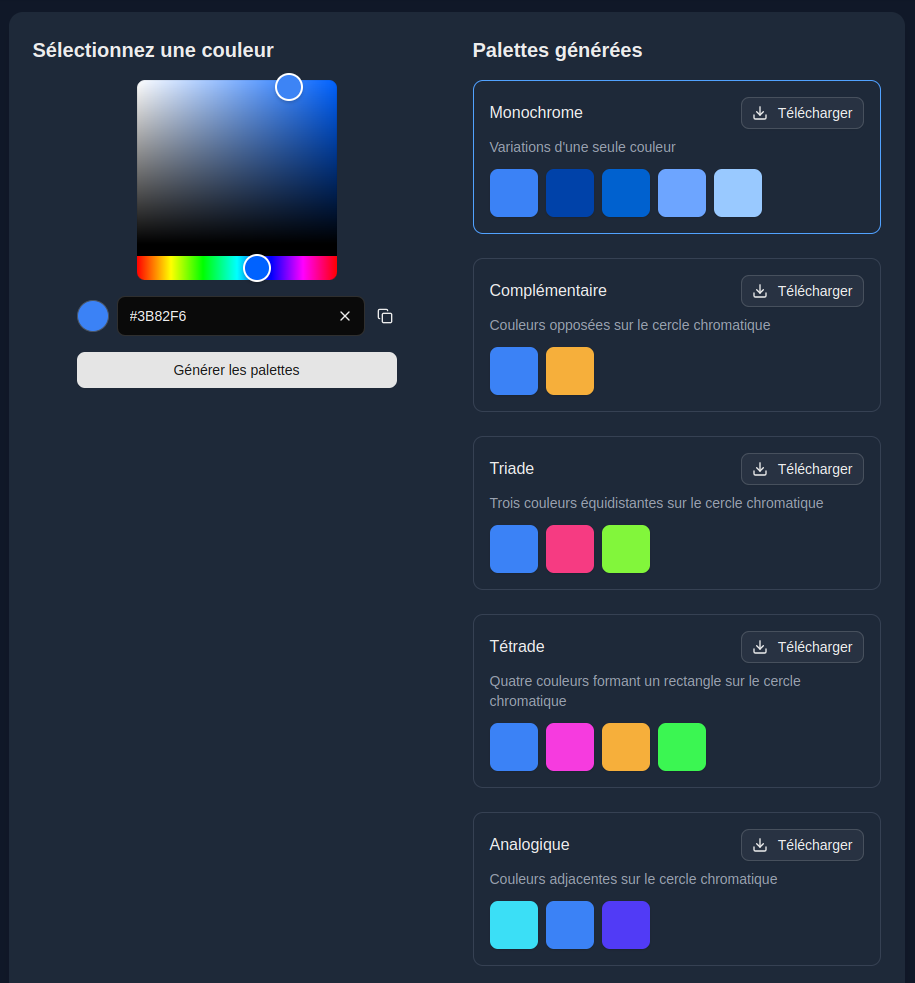

# ColorLoko - Générateur de Palettes de Couleurs

ColorLoko est un outil puissant pour générer des palettes de couleurs harmonieuses à partir d'une couleur de base. Idéal pour les designers, développeurs et créateurs de contenu qui ont besoin de créer des palettes de couleurs cohérentes pour leurs projets.

## Fonctionnalités

- Sélection de couleur intuitive avec un color picker visuel
- Saisie manuelle de codes hexadécimaux
- Génération de 6 types de palettes différentes :
  - Monochrome : variations d'une seule couleur
  - Complémentaire : couleurs opposées sur le cercle chromatique
  - Triade : trois couleurs équidistantes sur le cercle chromatique
  - Tétrade : quatre couleurs formant un rectangle sur le cercle chromatique
  - Analogique : couleurs adjacentes sur le cercle chromatique
  - Nuances : variations de saturation et luminosité
- Copie rapide des codes couleur
- Export des palettes au format JSON
- Interface responsive et support du mode sombre

## Installation

```bash
# Cloner le dépôt
git clone https://github.com/Happy-Franck/colorloko.git
cd colorloko

# Installer les dépendances
npm install
```

## Utilisation

### Mode Développement

Pour lancer le projet en mode développement avec les outils de développement :

```bash
npm run dev
```

Puis ouvrez [http://localhost:3000](http://localhost:3000) dans votre navigateur.

### Mode Production

Pour lancer le projet en mode production sans les outils de développement :

```bash
# Construire le projet
npm run build

# Démarrer le serveur de production
npm start
```

Puis ouvrez [http://localhost:3000](http://localhost:3000) dans votre navigateur.

## Intégration du Composant

Vous pouvez facilement intégrer le générateur de palettes de couleurs dans n'importe quelle page de votre application Next.js :

```tsx
"use client";

import { ColorPaletteGenerator } from "@/components/color-palette";

export default function MaPage() {
  return (
    <div>
      <ColorPaletteGenerator 
        initialColor="#3B82F6" 
        onPaletteSelect={(palette) => {
          console.log(palette);
        }}
      />
    </div>
  );
}
```

### Propriétés du Composant

| Propriété | Type | Description | Par défaut |
|-----------|------|-------------|------------|
| `initialColor` | `string` | Couleur initiale au format hexadécimal | `"#3B82F6"` |
| `onPaletteSelect` | `(palette: ColorPalette) => void` | Callback appelé lorsqu'une palette est sélectionnée | `undefined` |

## Captures d'écran



## Technologies Utilisées

- [Next.js](https://nextjs.org/) - Framework Next.JS
- [React Colorful](https://github.com/omgovich/react-colorful) - Sélecteur de couleur
- [Chroma.js](https://gka.github.io/chroma.js/) - Manipulation des couleurs
- [Tailwind CSS](https://tailwindcss.com/) - Styles
- [Lucide Icons](https://lucide.dev/) - Icônes

